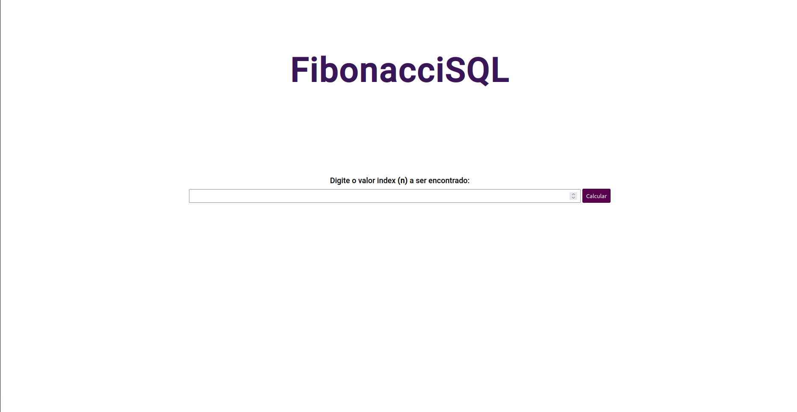
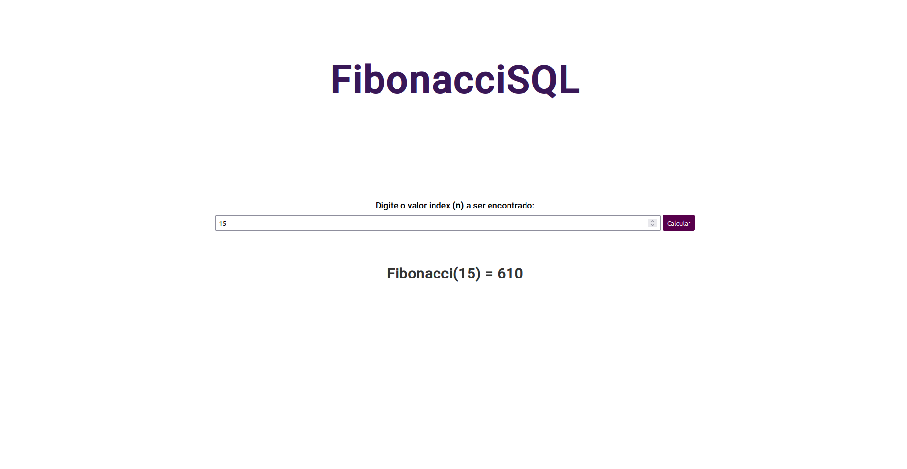

# FibonacciSQL

**Conteúdo da Disciplina**: Programação Dinâmica<br>

## Alunos

| Matrícula |                        Aluno                        |
| :-------: | :-------------------------------------------------: |
| 190025581 | [Bruno Oliveira Lima](https://github.com/eng-Bruno) |
| --------- |                        ----------                   |

## Sobre

Calcula o n-ésimo número da sequência de Fibonacci utilizando programação dinâmica.

## Screenshots




## Instalação

**Linguagem**:JavaScript<br>

## Como Rodar

Clonar o repositório do projeto:

```
git clone https://github.com/projeto-de-algoritmos/PD_FibonacciSQL.git

```

Após clonar o repositório localmente, abrir o arquivo index.html no navegador.

## Apresentação

[FibonacciSQL - Programação Dinâmica](./apresentação/FibonacciSQL.zip)


